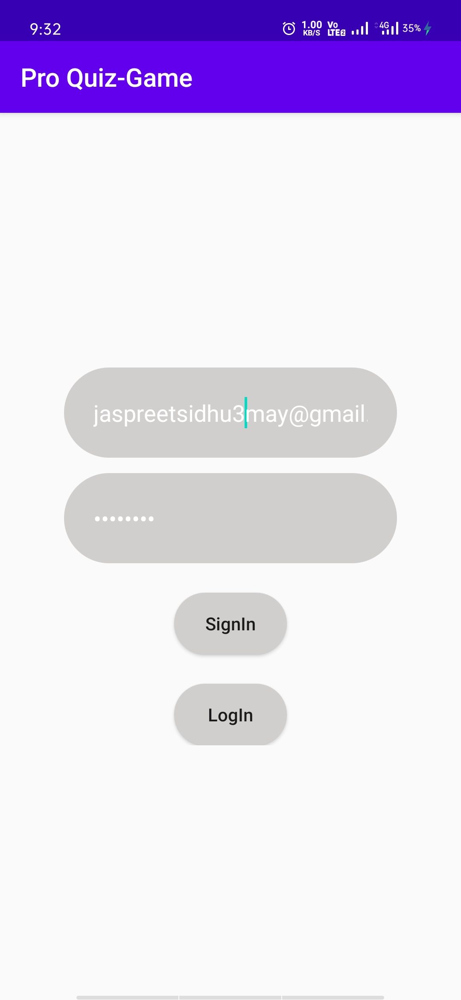
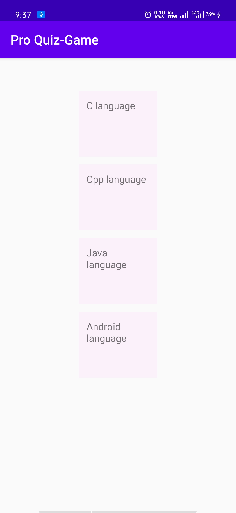
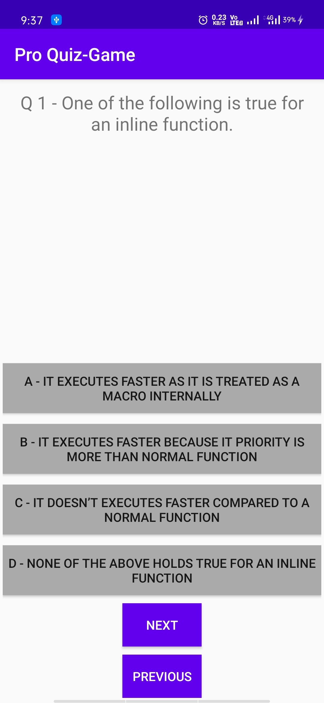
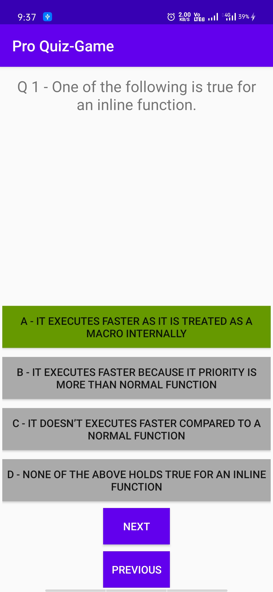
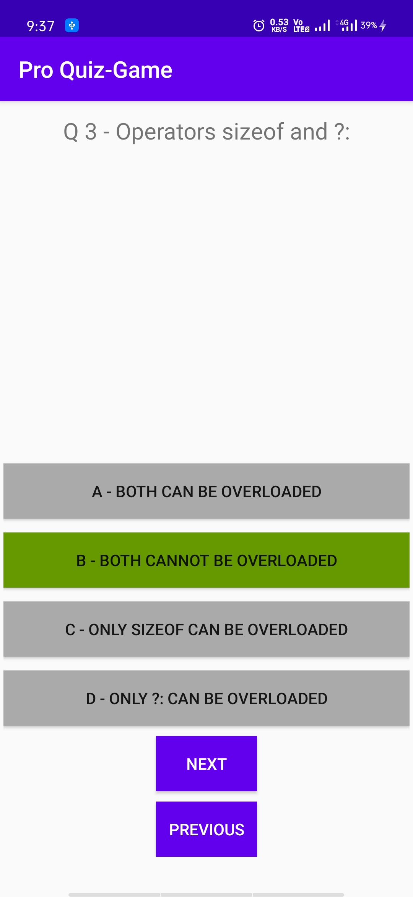
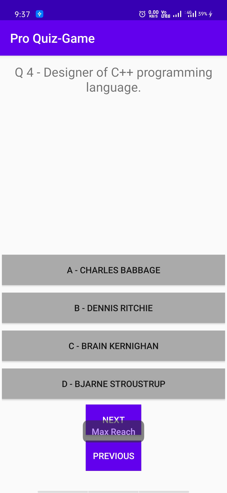

# Pro Quiz -Game

Android Application which provides programming related quiz for programmer and integrated with firebase login and signup page.

## Getting Started

1.Simply copy and .apk file on android mobile phones and install the application.  
2.Signup or Login.  
3.After Login you will come up with Home Screen with different sets of question. 
4.Start your Quiz.

### Prerequisites

Android Phone

## Screenshots

* Signup and Login Page

* Home Page

* Quiz Page
 

## Built With

* Android Studio

## Language implementation
* Java
## Backend
* Firebase

## Version

v1.0

## Authors

Jaspreet Singh

